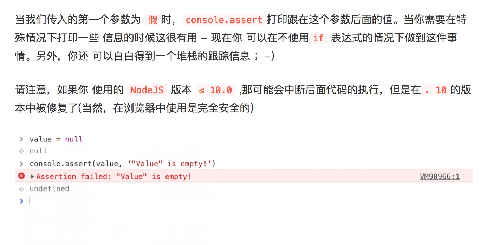

# 小本本--工作中各种笔记
## Chrome工具技巧
1. store as global 
>只需要右击它，并且选择“Store as global variable” (保存为全局变量)这个选项.
第一次使用的话，它会创建一个名为 temp1 的变量，然后是 temp2 等等

2. 保存(stack trace)堆栈跟踪
3. 保存HTML
## console methods
1. console.assert

2. console.table
>令人惊讶的是，这一个小技巧在开发者中并没有多少人知道.如果你有一个数组(或者是类数组的对象，或者就是一个对象)，你可以使用console.table方法将它以一个漂亮的表格的形式打印出来。它不仅仅会根据数组中包含的对象的所有属性，去计算出表中的列名，而且这些列都是可以缩放甚至...可以排序！😳
当列太多的时候，使用第二个参数，传入你想要展示的列对应的名字
3. console.dir
>用于打印DOM节点
## Elements panel元素面板
1. 通过H键来隐藏某个元素
2. 拖动 & 放置 元素
3. 或者使用control!(按钮)
>如果你只是想移动你当前选中的元素，在DOM结构中往上一点或者往下一点，而不是拖动和放置，你同样可以使用[ctrl] + [⬆] / [ctrl] + [⬇] ([⌘] + [⬆] /[⌘] + [⬇] on Mac).
